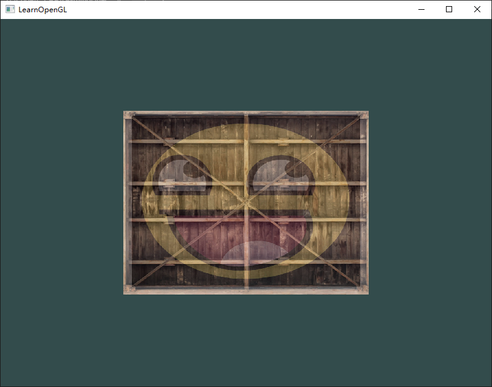
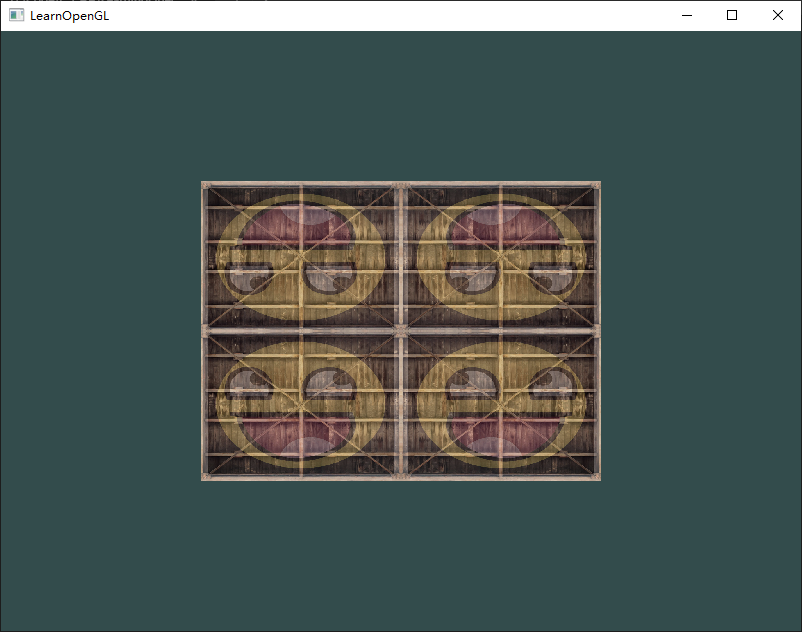
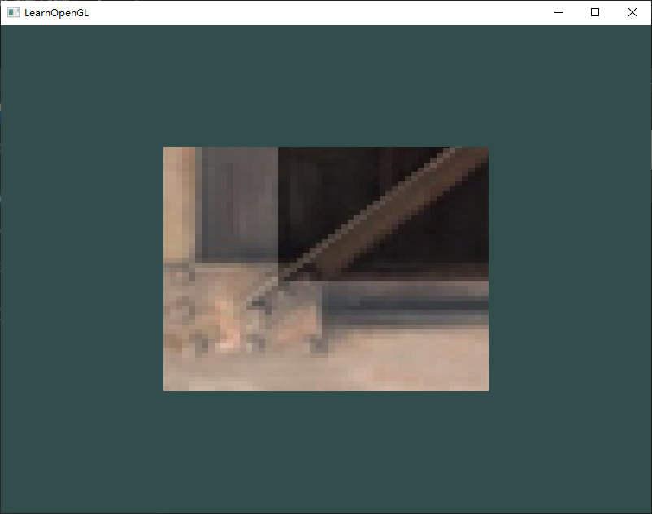

### 题目

1. 修改片段着色器，**仅**让笑脸图案朝另一个方向看，[参考解答](https://learnopengl.com/code_viewer_gh.php?code=src/1.getting_started/4.3.textures_exercise1/textures_exercise1.cpp)
2. 尝试用不同的纹理环绕方式，设定一个从`0.0f`到`2.0f`范围内的（而不是原来的`0.0f`到`1.0f`）纹理坐标。试试看能不能在箱子的角落放置4个笑脸：[参考解答](https://learnopengl.com/code_viewer_gh.php?code=src/1.getting_started/4.4.textures_exercise2/textures_exercise2.cpp)，[结果](https://learnopengl-cn.github.io/img/01/06/textures_exercise2.png)。记得一定要试试其它的环绕方式。
3. 尝试在矩形上只显示纹理图像的中间一部分，修改纹理坐标，达到能看见单个的像素的效果。尝试使用GL_NEAREST的纹理过滤方式让像素显示得更清晰：[参考解答](https://learnopengl.com/code_viewer_gh.php?code=src/1.getting_started/4.5.textures_exercise3/textures_exercise3.cpp)
4. 使用一个uniform变量作为mix函数的第三个参数来改变两个纹理可见度，使用上和下键来改变箱子或笑脸的可见度：[参考解答](https://learnopengl.com/code_viewer_gh.php?code=src/1.getting_started/4.6.textures_exercise4/textures_exercise4.cpp)

### 解答

#### 题目1

**题目**：修改片段着色器，**仅**让笑脸图案朝另一个方向看


##### 修改前

==fragment.glsl==：

```glsl
#version 330 core
out vec4 FragColor;
in vec3 ourColor;
in vec2 texCoord;

// 采样
uniform sampler2D texture1; // 默认传递为 0
uniform sampler2D texture2;

void main()
{

    FragColor = mix(texture(texture1, texCoord), texture(texture2, texCoord), 0.2);
}
```

##### 修改后

==fragment.glsl==：

```glsl
#version 330 core
out vec4 FragColor;
in vec3 ourColor;
in vec2 texCoord;

// 采样
uniform sampler2D texture1; // 默认传递为 0
uniform sampler2D texture2;

void main()
{

    FragColor = mix(texture(texture1, texCoord), texture(texture2, vec2(1 - texCoord.x, texCoord.y)), 0.2);
}
```

#### 题目2

**题目**：尝试用不同的纹理环绕方式，设定一个从`0.0f`到`2.0f`范围内的（而不是原来的`0.0f`到`1.0f`）纹理坐标。试试看能不能在箱子的角落放置4个笑脸。记得一定要试试其它的环绕方式。


##### 修改前

==vertex.glsl==：

```glsl
#version 330 core
layout (location = 0) in vec3 aPos;
layout (location = 1) in vec3 aColor;
layout (location = 2) in vec2 aTexCoord;

out vec3 ourColor;
out vec2 texCoord;

void main()
{
    gl_Position = vec4(aPos, 1.0f);
    ourColor = aColor;
    texCoord = aTexCoord;
}
```

==main.cpp==：

```cpp
    // 设置环绕和过滤方式
    glTexParameteri(GL_TEXTURE_2D, GL_TEXTURE_WRAP_S, GL_REPEAT);
    glTexParameteri(GL_TEXTURE_2D, GL_TEXTURE_WRAP_T, GL_REPEAT);
    glTexParameteri(GL_TEXTURE_2D, GL_TEXTURE_MIN_FILTER, GL_NEAREST);
    glTexParameteri(GL_TEXTURE_2D, GL_TEXTURE_MAG_FILTER, GL_LINEAR);
```

##### 修改后

==vertex.glsl==：

```glsl
#version 330 core
layout (location = 0) in vec3 aPos;
layout (location = 1) in vec3 aColor;
layout (location = 2) in vec2 aTexCoord;

out vec3 ourColor;
out vec2 texCoord;

void main()
{
    gl_Position = vec4(aPos, 1.0f);
    ourColor = aColor;
    texCoord = aTexCoord * 2.0f;
}
```

==main.cpp==：

```cpp
    glTexParameteri(GL_TEXTURE_2D, GL_TEXTURE_WRAP_S, GL_MIRRORED_REPEAT);
    glTexParameteri(GL_TEXTURE_2D, GL_TEXTURE_WRAP_T, GL_MIRRORED_REPEAT);
    glTexParameteri(GL_TEXTURE_2D, GL_TEXTURE_MIN_FILTER, GL_NEAREST);
    glTexParameteri(GL_TEXTURE_2D, GL_TEXTURE_MAG_FILTER, GL_LINEAR);
```

|  |  |
| :----------------------------------------------------------: | :----------------------------------------------------------: |
|                             原先                             |                             现在                             |

#### 题目3

**题目**：尝试在矩形上只显示纹理图像的中间一部分，修改纹理坐标，达到能看见单个的像素的效果。尝试使用GL_NEAREST的纹理过滤方式让像素显示得更清晰


##### 修改前

==vertex.glsl==：

```glsl
#version 330 core
layout (location = 0) in vec3 aPos;
layout (location = 1) in vec3 aColor;
layout (location = 2) in vec2 aTexCoord;

out vec3 ourColor;
out vec2 texCoord;

void main()
{
    gl_Position = vec4(aPos, 1.0f);
    ourColor = aColor;
    texCoord = aTexCoord;
}
```

==main.cpp==：

```cpp
    // 设置环绕和过滤方式
    glTexParameteri(GL_TEXTURE_2D, GL_TEXTURE_WRAP_S, GL_REPEAT);
    glTexParameteri(GL_TEXTURE_2D, GL_TEXTURE_WRAP_T, GL_REPEAT);
    glTexParameteri(GL_TEXTURE_2D, GL_TEXTURE_MIN_FILTER, GL_NEAREST);
    glTexParameteri(GL_TEXTURE_2D, GL_TEXTURE_MAG_FILTER, GL_LINEAR);
```

##### 修改后

==vertex.glsl==：

```glsl
#version 330 core
layout (location = 0) in vec3 aPos;
layout (location = 1) in vec3 aColor;
layout (location = 2) in vec2 aTexCoord;

out vec3 ourColor;
out vec2 texCoord;

void main()
{
    gl_Position = vec4(aPos, 1.0f);
    ourColor = aColor;
    texCoord = aTexCoord * 0.1f;
}
```

==main.cpp==：

```cpp
    // 设置环绕和过滤方式
    glTexParameteri(GL_TEXTURE_2D, GL_TEXTURE_WRAP_S, GL_REPEAT);
    glTexParameteri(GL_TEXTURE_2D, GL_TEXTURE_WRAP_T, GL_REPEAT);
    glTexParameteri(GL_TEXTURE_2D, GL_TEXTURE_MIN_FILTER, GL_NEAREST);
    glTexParameteri(GL_TEXTURE_2D, GL_TEXTURE_MAG_FILTER, GL_NEAREST);
```

|  |  |
| :----------------------------------------------------------: | :----------------------------------------------------------: |
|                          GL_LINEAR                           |                          GL_NEAREST                          |

#### 题目4

**题目**：使用一个uniform变量作为mix函数的第三个参数来改变两个纹理可见度，使用上和下键来改变箱子或笑脸的可见度


##### 修改前

==fragment.glsl==：

```glsl
#version 330 core
out vec4 FragColor;
in vec3 ourColor;
in vec2 texCoord;

// 采样
uniform sampler2D texture1; // 默认传递为 0
uniform sampler2D texture2;

void main()
{

    FragColor = mix(texture(texture1, texCoord), texture(texture2, texCoord), 0.2f);
}
```

==main.cpp==：

```cpp
    // 设置填充绘制模式
    glPolygonMode(GL_FRONT_AND_BACK, GL_FILL);

    while (!glfwWindowShouldClose(window))
    {
        ProcessInput(window);

        // 渲染指令
        glClearColor(0.2f, 0.3f, 0.3f, 1.0f);
        glClear(GL_COLOR_BUFFER_BIT);

        ourShader.use();

        glActiveTexture(GL_TEXTURE0);
        glBindTexture(GL_TEXTURE_2D, texture1);

        glActiveTexture(GL_TEXTURE1);
        glBindTexture(GL_TEXTURE_2D, texture2);

        glBindVertexArray(VAO);
        glDrawElements(GL_TRIANGLES, 6, GL_UNSIGNED_INT, 0);

        glfwSwapBuffers(window);
        glfwPollEvents();
    }
```

##### 修改后

==fragment.glsl==：

```glsl
#version 330 core
out vec4 FragColor;
in vec3 ourColor;
in vec2 texCoord;

// 采样
uniform sampler2D texture1; // 默认传递为 0
uniform sampler2D texture2;

uniform float mixValue;

void main()
{

    FragColor = mix(texture(texture1, texCoord), texture(texture2, texCoord), abs(sin(mixValue * 0.5f)));
}
```

==main.cpp==：

```cpp
    float mixValue = 0.0f;

    // 设置填充绘制模式
    glPolygonMode(GL_FRONT_AND_BACK, GL_FILL);

    while (!glfwWindowShouldClose(window))
    {
        ProcessInput(window);

        // 渲染指令
        glClearColor(0.2f, 0.3f, 0.3f, 1.0f);
        glClear(GL_COLOR_BUFFER_BIT);

        ourShader.use();
        mixValue = glfwGetTime();
        ourShader.setFloat("mixValue", mixValue);

        glActiveTexture(GL_TEXTURE0);
        glBindTexture(GL_TEXTURE_2D, texture1);

        glActiveTexture(GL_TEXTURE1);
        glBindTexture(GL_TEXTURE_2D, texture2);

        glBindVertexArray(VAO);
        glDrawElements(GL_TRIANGLES, 6, GL_UNSIGNED_INT, 0);

        glfwSwapBuffers(window);
        glfwPollEvents();
    }
```
