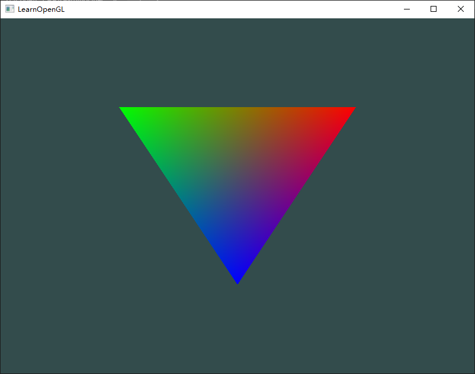
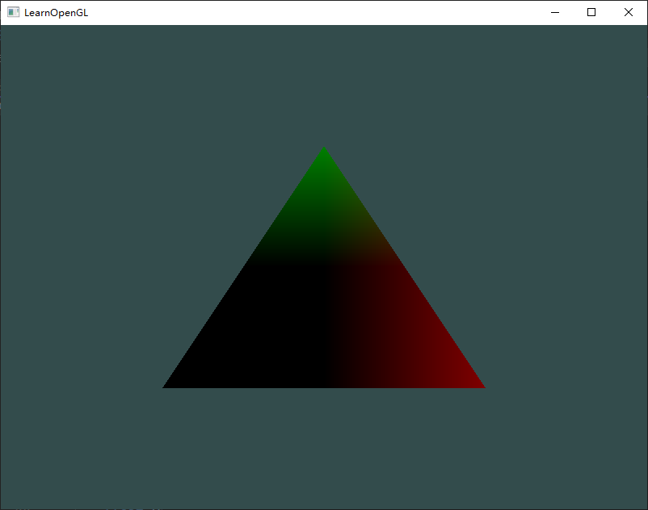

### 题目

1. 修改顶点着色器让三角形上下颠倒：[参考解答](https://learnopengl.com/code_viewer.php?code=getting-started/shaders-exercise1)
2. 使用uniform定义一个水平偏移量，在顶点着色器中使用这个偏移量把三角形移动到屏幕右侧：[参考解答](https://learnopengl.com/code_viewer.php?code=getting-started/shaders-exercise2)
3. 使用`out`关键字把顶点位置输出到片段着色器，并将片段的颜色设置为与顶点位置相等（来看看连顶点位置值都在三角形中被插值的结果）。做完这些后，尝试回答下面的问题：为什么在三角形的左下角是黑的?：[参考解答](https://learnopengl.com/code_viewer.php?code=getting-started/shaders-exercise3)

### 解答

#### 题目1

**题目**：修改顶点着色器让三角形上下颠倒


##### 修改前

==vertex.glsl==：

```glsl
#version 330 core
layout (location = 0) in vec3 aPos;
layout (location = 1) in vec3 aColor;

out vec3 ourColor;

void main()
{
    gl_Position = vec4(aPos, 1.0f);
    ourColor = aColor;
}
```

##### 修改后

==vertex.glsl==：

```glsl
#version 330 core
layout (location = 0) in vec3 aPos;
layout (location = 1) in vec3 aColor;

out vec3 ourColor;

void main()
{
    gl_Position = vec4(aPos.x, -aPos.y, aPos.z, 1.0f); // 修改
    ourColor = aColor;
}
```

|  |  |
| :----------------------------------------------------------: | :----------------------------------------------------------: |
|                             原先                             |                             现在                             |

#### 题目2

**题目**：使用uniform定义一个水平偏移量，在顶点着色器中使用这个偏移量把三角形移动到屏幕右侧


##### 修改前

==vertex.glsl==：

```glsl
#version 330 core
layout (location = 0) in vec3 aPos;
layout (location = 1) in vec3 aColor;

out vec3 ourColor;

void main()
{
    gl_Position = vec4(aPos.x, aPos.y, aPos.z, 1.0f);
    ourColor = aColor;
}
```

==main.cpp==：

```cpp
   // 设置填充绘制模式 
	glPolygonMode(GL_FRONT_AND_BACK, GL_FILL);

    while (!glfwWindowShouldClose(window))
    {
        ProcessInput(window);

        // 渲染指令
        glClearColor(0.2f, 0.3f, 0.3f, 1.0f);
        glClear(GL_COLOR_BUFFER_BIT);

        ourShader.use();
        glBindVertexArray(VAO);
        //glDrawArrays(GL_POINTS, 0, 3);
        //glDrawArrays(GL_LINE_LOOP, 0, 3);
        glDrawArrays(GL_TRIANGLES, 0, 3);

        glfwSwapBuffers(window);
        glfwPollEvents();
    }
```

##### 修改后

==vertex.glsl==：

```glsl
#version 330 core
layout (location = 0) in vec3 aPos;
layout (location = 1) in vec3 aColor;

out vec3 ourColor;

uniform float xOffset; // 新行

void main()
{
    gl_Position = vec4(aPos.x + xOffset, aPos.y, aPos.z, 1.0f); // 修改
    ourColor = aColor;
}
```

==main.cpp==：

```cpp
    // 设置填充绘制模式
    glPolygonMode(GL_FRONT_AND_BACK, GL_FILL);
    float xOffset = 0.5f; // 新行

    while (!glfwWindowShouldClose(window))
    {
        ProcessInput(window);

        // 渲染指令
        glClearColor(0.2f, 0.3f, 0.3f, 1.0f);
        glClear(GL_COLOR_BUFFER_BIT);

        ourShader.use();
        ourShader.setFloat("xOffset", xOffset); // 新行
        glBindVertexArray(VAO);
        //glDrawArrays(GL_POINTS, 0, 3);
        //glDrawArrays(GL_LINE_LOOP, 0, 3);
        glDrawArrays(GL_TRIANGLES, 0, 3);

        glfwSwapBuffers(window);
        glfwPollEvents();
    }
```

|  |  |
| :----------------------------------------------------------: | :----------------------------------------------------------: |
|                             原先                             |                             现在                             |

#### 题目3

**题目**：使用`out`关键字把顶点位置输出到片段着色器，并将片段的颜色设置为与顶点位置相等（来看看连顶点位置值都在三角形中被插值的结果）。做完这些后，尝试回答下面的问题：为什么在三角形的左下角是黑的?


##### 修改前

==vertex.glsl==：

```glsl
#version 330 core
layout (location = 0) in vec3 aPos;
layout (location = 1) in vec3 aColor;

out vec3 ourColor;

void main()
{
    gl_Position = vec4(aPos.x, aPos.y, aPos.z, 1.0f);
    ourColor = aColor;
}
```

==fragment.glsl==：

```glsl
#version 330 core
out vec4 FragColor;
in vec3 ourColor;

void main()
{
    FragColor = vec4(ourColor, 1.0f);
}
```

##### 修改后

==vertex.glsl==：

```glsl
#version 330 core
layout (location = 0) in vec3 aPos;
layout (location = 1) in vec3 aColor;

out vec3 ourColor;
out vec3 ourPos;

void main()
{
    gl_Position = vec4(aPos.x, aPos.y, aPos.z, 1.0f);
    ourColor = aColor;
    ourPos = aPos;
}
```

==fragment.glsl==：

```glsl
#version 330 core
out vec4 FragColor;
in vec3 ourColor;
in vec3 ourPos;

void main()
{
    FragColor = vec4(ourPos, 1.0f);
}
```

|  |  |
| :----------------------------------------------------------: | :----------------------------------------------------------: |
|                             原先                             |                             现在                             |

> 为什么左下角是黑色的？

答：左下角的坐标都为负，被视为了0，因此都为黑色