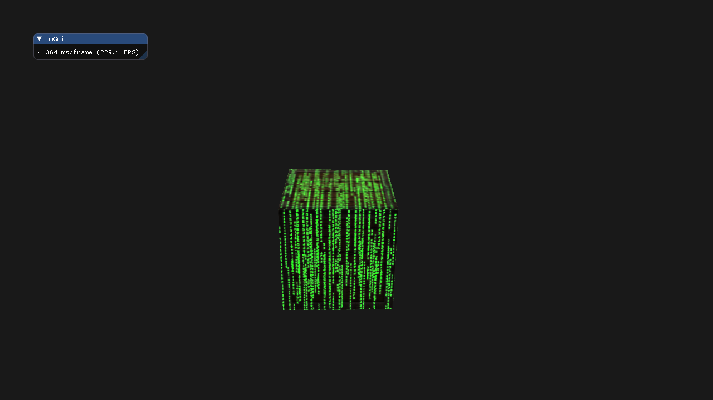

### 题目

1. 调整光源的环境光、漫反射和镜面光向量，看看它们如何影响箱子的视觉输出。
2. 尝试在片段着色器中反转镜面光贴图的颜色值，让木头显示镜面高光而钢制边缘不反光（由于钢制边缘中有一些裂缝，边缘仍会显示一些镜面高光，虽然强度会小很多）：[参考解答](https://learnopengl.com/code_viewer.php?code=lighting/lighting_maps-exercise2)
3. 使用漫反射贴图创建一个彩色而不是黑白的镜面光贴图，看看结果看起来并不是那么真实了。如果你不会生成的话，可以使用这张[彩色的镜面光贴图](https://learnopengl-cn.github.io/img/02/04/lighting_maps_specular_color.png)：[最终效果](https://learnopengl-cn.github.io/img/02/04/lighting_maps_exercise3.png)
4. 添加一个叫做放射光贴图(Emission Map)的东西，它是一个储存了每个片段的发光值(Emission Value)的贴图。发光值是一个包含（假设）光源的物体发光(Emit)时可能显现的颜色，这样的话物体就能够忽略光照条件进行发光(Glow)。游戏中某个物体在发光的时候，你通常看到的就是放射光贴图（比如 [机器人的眼](https://learnopengl-cn.github.io/img/02/04/shaders_enemy.jpg)，或是[箱子上的灯带](https://learnopengl-cn.github.io/img/02/04/emissive.png)）。将[这个](https://learnopengl-cn.github.io/img/02/04/matrix.jpg)纹理（作者为 creativesam）作为放射光贴图添加到箱子上，产生这些字母都在发光的效果：[参考解答](https://learnopengl.com/code_viewer_gh.php?code=src/2.lighting/4.4.lighting_maps_exercise4/lighting_maps_exercise4.cpp)，[最终效果](https://learnopengl-cn.github.io/img/02/04/lighting_maps_exercise4.png)

### 解答

#### 题目2

**题目**：尝试在片段着色器中反转镜面光贴图的颜色值，让木头显示镜面高光而钢制边缘不反光（由于钢制边缘中有一些裂缝，边缘仍会显示一些镜面高光，虽然强度会小很多）。


##### 修改前

==fragment.glsl==：

```glsl
vec3 specular = light.specular * (spec * specularTexture);
```

##### 修改后

==fragment.glsl==：

```glsl
vec3 specular = light.specular * (spec * (vec3(1.0f) - specularTexture));
```

 反转操作 `vec3(1.0) - specularTexture`

- 这个操作对 `specularTexture` 中的每个颜色分量都执行了 `1.0 - value`。
- 效果：
  - 原本是 **白色 (1.0)** 的区域 → 变成 **黑色 (0.0)**。
  - 原本是 **黑色 (0.0)** 的区域 → 变成 **白色 (1.0)**。
  - 原本是 **灰色 (0.5)** 的区域 → 变成 **灰色 (0.5)** （居中不变）。
- **结果**：原本反光的区域（钢制边缘）现在不反光了，原本不反光的区域（木头）现在可以反光了。这正是题目要求的“让木头显示镜面高光而钢制边缘不反光”。

#### 题目3

**题目**：使用漫反射贴图创建一个彩色而不是黑白的镜面光贴图，看看结果看起来并不是那么真实了。


##### 修改前

==main.cpp==：

```cpp
unsigned int specularMap = loadTexture(std::string(ASSETS_DIR) + "/texture/container2_specular.png");
```

##### 修改后

==main.cpp==：

```cpp
unsigned int specularMap = loadTexture(std::string(ASSETS_DIR) + "/texture/lighting_maps_specular_color.png");
```

|  |  |
| :----------------------------------------------------------: | :----------------------------------------------------------: |
|                             原先                             |                             现在                             |

#### 题目4

**题目**：添加一个叫做放射光贴图(Emission Map)的东西，它是一个储存了每个片段的发光值(Emission Value)的贴图。发光值是一个包含（假设）光源的物体发光(Emit)时可能显现的颜色，这样的话物体就能够忽略光照条件进行发光(Glow)。游戏中某个物体在发光的时候，你通常看到的就是放射光贴图（比如 机器人的眼，或是箱子上的灯带）。将[这个](https://learnopengl-cn.github.io/img/02/04/matrix.jpg)纹理（作者为 creativesam）作为放射光贴图添加到箱子上，产生这些字母都在发光的效果，[最终效果](https://learnopengl-cn.github.io/img/02/04/lighting_maps_exercise4.png)。


##### 修改前

==fragment.glsl==：

```glsl
// 定义材质结构体
struct Material
{
    sampler2D diffuse;  // 漫反射贴图
    sampler2D specular; // 镜面光贴图
    float shininess;    // 镜面光的高光指数
};

......

void main()
{
    ......
    vec3 result = ambient + diffuse + specular;
    ......
}
```

##### 修改后

==fragment.glsl==：

```glsl
// 定义材质结构体
struct Material
{
    sampler2D diffuse;  // 漫反射贴图
    sampler2D specular; // 镜面光贴图
    float shininess;    // 镜面光的高光指数
    sampler2D emission; // 放射光贴图
};

......

void main()
{
    vec3 emissionTexture = vec3(texture(material.emission, outTexCoord));
    ......
    // 放射光
    vec3 emission = 2.0f * emissionTexture;
    vec3 result = ambient + diffuse + specular + emission;
    ......
}
```

==main.cpp==：

```cpp
    unsigned int diffuseMap = loadTexture(std::string(ASSETS_DIR) + "/texture/container2.png");
    unsigned int specularMap = loadTexture(std::string(ASSETS_DIR) + "/texture/container2_specular.png");
    unsigned int emissionMap = loadTexture(std::string(ASSETS_DIR) + "/texture/matrix.jpg"); // 追加

    ourShader.use();
    ourShader.setInt("material.diffuse", 0);
    ourShader.setInt("material.specular", 1);
    ourShader.setInt("material.emission", 2); // 追加
	......
    while (!glfwWindowShouldClose(window))
    {
		 ......
        glActiveTexture(GL_TEXTURE0);
        glBindTexture(GL_TEXTURE_2D, diffuseMap);

        glActiveTexture(GL_TEXTURE1);
        glBindTexture(GL_TEXTURE_2D, specularMap);

        glActiveTexture(GL_TEXTURE2); // 追加
        glBindTexture(GL_TEXTURE_2D, emissionMap);     
        ......
    }
```

|  |  |
| :----------------------------------------------------------: | :----------------------------------------------------------: |
|                             原先                             |                             现在                             |
